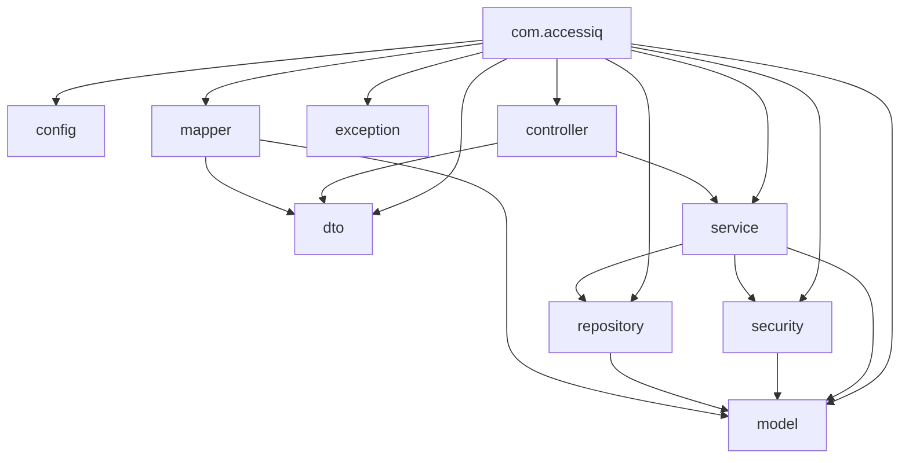

# Architecture Documentation

## System Overview

AccessIQ is a Spring Boot 3.2 application following a layered hexagonal architecture pattern. The system is designed to be modular, testable, and production-ready.

## Architecture Diagram

```mermaid
graph TD
    subgraph "Presentation Layer"
        A[REST Controllers] --> B[DTOs]
    end
    
    subgraph "Application Layer"
        B --> C[Service Layer]
        C --> D[Repository Layer]
    end
    
    subgraph "Infrastructure Layer"
        D --> E[Database]
        C --> F[Security]
        C --> G[JWT Provider]
    end
    
    subgraph "Cross-Cutting Concerns"
        H[Exception Handling] --> A
        I[Logging] --> C
        J[Monitoring] --> C
        K[Caching] --> D
    end
```

## Package Diagram

## Layer Descriptions

### Controller Layer
- `AuthController` - Authentication endpoints
- `RequestController` - Request management endpoints
- `AdminController` - Administrative endpoints
- `AuditController` - Audit logging endpoints
- `TestController` - Health check endpoint

### Service Layer
- `AuthService` - Authentication logic
- `UserService` - User management
- `RequestService` - Request processing
- `WorkflowService` - Workflow management
- `AuditService` - Audit logging
- `EscalationService` - SLA escalation
- `RefreshTokenService` - Token management

### Repository Layer
- `UserRepository` - User persistence
- `RoleRepository` - Role persistence
- `RequestRepository` - Request persistence
- `ApprovalStepRepository` - Approval step persistence
- `WorkflowDefinitionRepository` - Workflow persistence
- `WorkflowStepDefinitionRepository` - Workflow step persistence
- `AuditLogRepository` - Audit log persistence
- `RefreshTokenRepository` - Refresh token persistence

### Security Layer
- `JwtTokenProvider` - JWT token generation/validation
- `JwtAuthenticationFilter` - Request authentication
- `JwtAuthenticationEntryPoint` - Authentication entry point
- `JwtAccessDeniedHandler` - Access denied handling
- `CustomUserDetailsService` - User details service
- `CorrelationIdFilter` - Request correlation tracking
- `SecurityConfig` - Security configuration

## Design Patterns

1. **Repository Pattern** - Data access abstraction
2. **Service Layer Pattern** - Business logic encapsulation
3. **DTO Pattern** - Data transfer objects
4. **Builder Pattern** - Entity construction
5. **Strategy Pattern** - Workflow steps
6. **Observer Pattern** - Event-driven architecture

## Thread Safety

- All services are stateless and thread-safe
- Repositories are Spring Data JPA managed beans
- JWT tokens are immutable once created
- Refresh tokens are stored in database with proper locking

## Scalability Considerations

1. **Horizontal Scaling** - Stateless services can be scaled horizontally
2. **Connection Pooling** - HikariCP configured with 20 connections
3. **Caching** - Spring Cache abstraction available
4. **Database** - Indexes on all foreign keys and search columns