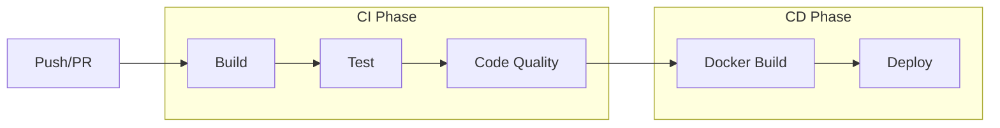

# CI/CD Documentation

## Overview

AccessIQ uses GitHub Actions for continuous integration and deployment.

## Pipeline Architecture



## GitHub Actions Workflow

The pipeline is defined in `.github/workflows/ci-cd.yml`:

### Jobs

1. **build** - Compile and package
2. **test** - Run unit tests
3. **sonar** - Code quality analysis
4. **build-and-push** - Docker image build and push

### Triggers

- Push to `main`, `master`, `develop`
- Pull requests to `main`, `master`

## Build Job

```yaml
jobs:
  build:
    runs-on: ubuntu-latest
    steps:
      - Checkout
      - Setup JDK 17
      - Build with Maven
      - Upload JaCoCo report
      - Upload artifacts
```

## Test Job

```yaml
jobs:
  test:
    runs-on: ubuntu-latest
    needs: build
    steps:
      - Checkout
      - Setup JDK 17
      - Run tests
      - Upload test results
```

## SonarQube Analysis

```yaml
jobs:
  sonar:
    runs-on: ubuntu-latest
    needs: build
    steps:
      - Checkout
      - Setup JDK 17
      - SonarCloud Scan
```

## Docker Build

```yaml
jobs:
  build-and-push:
    runs-on: ubuntu-latest
    needs: [test, sonar]
    if: github.event_name == 'push' && github.ref == 'refs/heads/main'
    steps:
      - Checkout
      - Setup JDK 17
      - Setup Docker Buildx
      - Login to Container Registry
      - Build and push image
```

## Quality Gates

### Code Coverage
- Minimum: 15% line coverage
- Reported via JaCoCo

### Checkstyle
- XML configuration in `checkstyle-checker.xml`
- Suppressed violations in `checkstyle-suppressions.xml`

### SonarQube
- Quality gate must pass
- Bugs, vulnerabilities, code smells tracked

## Artifacts

### Maven Artifacts
- JAR file: `target/accessiq-1.0.0.jar`
- Coverage report: `target/site/jacoco/`
- Test results: `target/surefire-reports/`

### Docker Images
- Tagged as `accessiq:latest`
- Built for multi-platform (amd64, arm64)

## Environment Variables

Required secrets in GitHub repository:

| Secret | Description |
|--------|-------------|
| `SONAR_TOKEN` | SonarQube analysis token |
| `SONAR_HOST_URL` | SonarQube server URL |
| `DB_PASSWORD` | Database password |
| `JWT_SECRET` | JWT secret key |
| `ADMIN_EMAIL` | Admin user email |
| `ADMIN_PASSWORD` | Admin password |

## Deployment

### Manual Deployment

```bash
# Build image
docker build -t accessiq:latest .

# Push to registry
docker push ghcr.io/owner/accessiq:latest

# Deploy to server
ssh user@server "docker pull ghcr.io/owner/accessiq:latest && docker-compose up -d"
```

### Automated Deployment

The pipeline automatically deploys to production when:
- Push to main branch
- All jobs pass
- Quality gates pass

## Rollback Strategy

1. Keep previous Docker images
2. Kubernetes deployment revision history
3. Database migrations are forward-only

## Monitoring

### Build Metrics
- Build time
- Test execution time
- Coverage change
- SonarQube quality gate

### Alerts
- Build failures
- Test failures
- Coverage drops
- SonarQube quality gate failures

## Branch Strategy

| Branch | Purpose |
|--------|---------|
| main | Production |
| master | Production (alternative) |
| develop | Development |
| feature/* | Feature branches |
| hotfix/* | Hotfixes |
| release/* | Releases |

## Best Practices

1. **Fast builds** - Keep build time under 5 minutes
2. **Fail fast** - Stop pipeline on first failure
3. **Cache dependencies** - Maven and Docker layer caching
4. **Parallel jobs** - Run independent jobs in parallel
5. **Quality gates** - Don't deploy if quality gates fail
6. **Artifacts** - Always publish test results and coverage