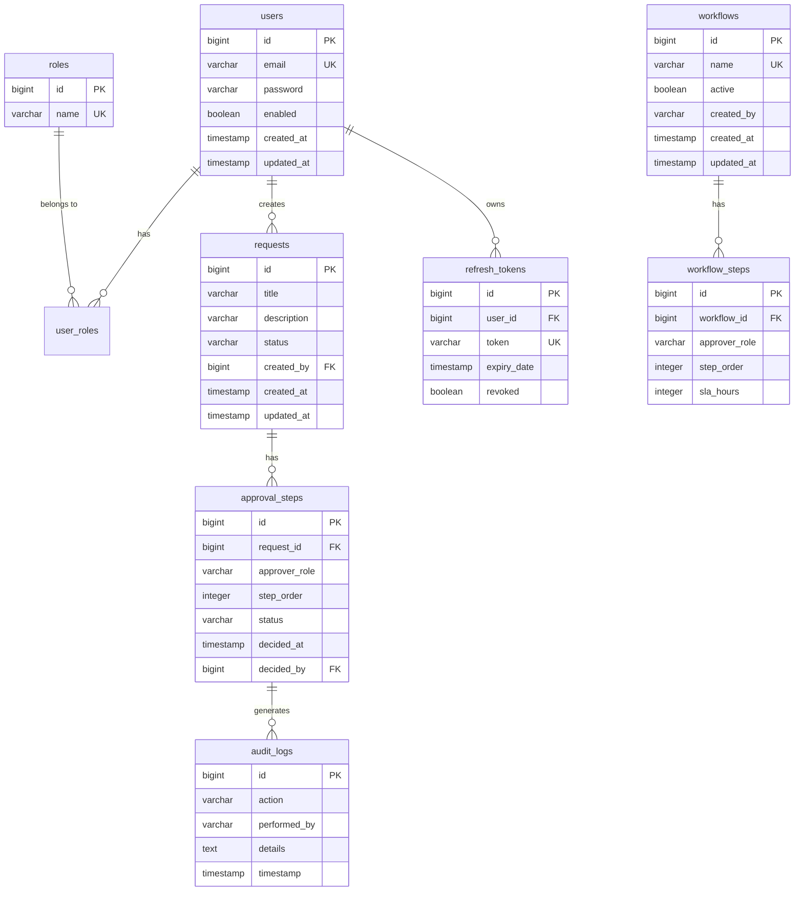

# Database Documentation

## Overview

AccessIQ uses JPA/Hibernate for database access with support for:
- PostgreSQL (recommended for production)
- MySQL (alternative for production)
- H2 (for development and testing)

## Entity Relationship Diagram



## Indexes

### Users Table
- `idx_users_email` - Unique index on email
- `idx_users_created_at` - Index for audit queries

### Requests Table
- `idx_requests_status` - Index for status filtering
- `idx_requests_created_by` - Index for creator lookups
- `idx_requests_created_at` - Index for audit queries
- `idx_requests_title` - Index for search

### Approval Steps Table
- `idx_approval_steps_request_id` - Foreign key index
- `idx_approval_steps_status` - Index for status filtering
- `idx_approval_steps_approver_role` - Index for role-based queries
- `idx_approval_steps_step_order` - Index for ordering
- `idx_approval_steps_sla_due_at` - Index for escalation queries

### Workflows Table
- `idx_workflows_active` - Index for active workflow queries
- `idx_workflows_created_at` - Index for audit queries
- `idx_workflows_created_by` - Index for creator lookups
- `idx_workflows_name` - Unique index on name

### User Roles Table
- `idx_user_roles_user_id` - Foreign key index
- `idx_user_roles_role_id` - Foreign key index

### Audit Logs Table
- `idx_audit_logs_action` - Index for action filtering
- `idx_audit_logs_performed_by` - Index for performer filtering
- `idx_audit_logs_timestamp` - Index for time-based queries

### Refresh Tokens Table
- `idx_refresh_tokens_user_id` - Foreign key index
- `idx_refresh_tokens_expiry` - Index for token expiration
- `idx_refresh_tokens_revoked` - Index for revoked tokens
- `idx_refresh_tokens_token` - Unique index on token

## Constraints

### Users
- Email is unique and not null
- Password is required
- Enabled defaults to true

### Roles
- Name is unique and not null
- Must be one of: EMPLOYEE, MANAGER, ADMIN, AUDITOR

### Requests
- Title is required
- Status defaults to PENDING
- Created by is required

### Approval Steps
- Request ID and step order combination is unique
- Approver role must be valid
- Status defaults to PENDING

### Workflows
- Name is unique
- Active defaults to true

## Transactions

All database operations use Spring's `@Transactional` annotation:
- Read-only transactions for queries
- Read-write transactions for modifications
- Proper rollback on exceptions

## Connection Pool Configuration

```yaml
spring:
  datasource:
    hikari:
      pool-name: HikariCP
      maximum-pool-size: 20
      minimum-idle: 5
      idle-timeout: 600000
      max-lifetime: 1800000
      connection-timeout: 30000
```

## Migration Strategy

The application uses Hibernate's DDL auto:
- `update` for development
- `validate` for production

For production, consider using Flyway or Liquibase for proper migrations.