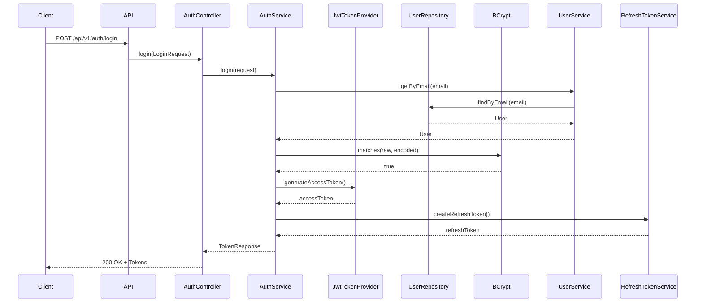

# Security Documentation

## Overview

AccessIQ implements enterprise-grade security measures including JWT authentication, role-based access control, and secure configuration practices.

## Authentication Flow



## JWT Token Structure

```
Header: {
  "alg": "HS256",
  "typ": "JWT"
}
Payload: {
  "sub": "user@example.com",
  "roles": ["EMPLOYEE"],
  "iat": 1516239022,
  "exp": 1516242622
}
Signature: HMACSHA256(
  base64UrlEncode(header) + "." +
  base64UrlEncode(payload),
  secret
)
```

## Role-Based Access Control

| Role | Permissions |
|------|-------------|
| EMPLOYEE | Create requests, view own requests |
| MANAGER | Approve/reject requests (as approver) |
| ADMIN | All operations, user management, workflow management |
| AUDITOR | View audit logs, read-only access |

## Password Security

- BCrypt hashing with strength 12
- Minimum password length: 8 characters
- Passwords are never stored in plain text

## Security Headers

```java
SecurityConfig {
    cors: enabled with allowed patterns
    csrf: disabled (stateless API)
    headers: enabled
}
```

## CORS Configuration

```java
CorsConfiguration {
    allowedOrigins: "*"
    allowedMethods: GET, POST, PUT, DELETE, PATCH, OPTIONS
    allowedHeaders: Authorization, Content-Type, X-Refresh-Token, etc.
    exposedHeaders: X-Correlation-ID
    allowCredentials: true
    maxAge: 3600
}
```

## Input Validation

All inputs are validated using Jakarta Bean Validation:

```java
public class LoginRequest {
    @NotBlank(message = "Email is required")
    @Email(message = "Email must be valid")
    @Size(max = 100)
    private String email;
    
    @NotBlank(message = "Password is required")
    @Size(max = 100)
    private String password;
}
```

## Exception Handling

Global exception handler returns consistent error responses:

```json
{
  "timestamp": "2024-01-15T10:30:00.000+00:00",
  "status": 400,
  "error": "Bad Request",
  "message": "Validation failed",
  "path": "/api/v1/auth/login"
}
```

## Secrets Management

### Environment Variables

Never commit secrets to version control. Use environment variables:

```bash
JWT_SECRET=your-256-character-secret-key
DB_PASSWORD=secure_database_password
ADMIN_PASSWORD=SecureAdminPassword123
```

### .env File

```bash
# .env.example
DB_URL=jdbc:postgresql://localhost:5432/accessiq
DB_USERNAME=accessiq_user
DB_PASSWORD=
JWT_SECRET=
ADMIN_EMAIL=admin@accessiq.com
ADMIN_PASSWORD=
SAMPLE_PASSWORD=
```

## Security Testing

### Test Coverage

- Authentication tests
- Authorization tests
- Invalid token tests
- Expired token tests
- Role-based access tests

### Running Security Tests

```bash
./mvnw test -Dtest=*Security*
./mvnw test -Dtest=*Auth*
```

## Common Vulnerabilities Protected

| Vulnerability | Protection |
|--------------|------------|
| SQL Injection | Parameterized queries (Spring Data JPA) |
| XSS | Input validation, output encoding |
| CSRF | Disabled for stateless API |
| Broken Authentication | JWT with BCrypt |
| Broken Access Control | RBAC with @PreAuthorize |
| Sensitive Data Exposure | BCrypt password hashing |
| Security Misconfiguration | Secure defaults |
| Broken Logging | Correlation IDs, audit logs |

## Security Checklist

- [x] JWT authentication implemented
- [x] Passwords hashed with BCrypt
- [x] Role-based access control
- [x] Input validation on all endpoints
- [x] Secure error handling
- [x] CORS configured
- [x] Security headers enabled
- [x] Secrets from environment variables
- [x] Audit logging for security events